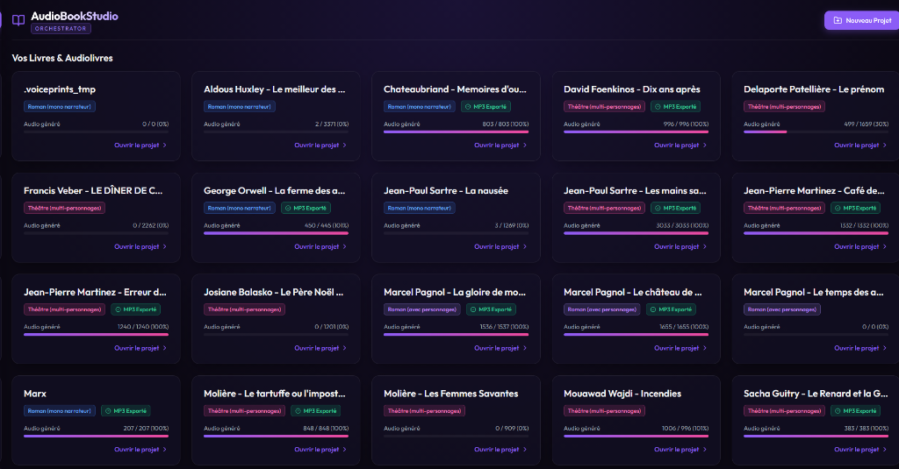
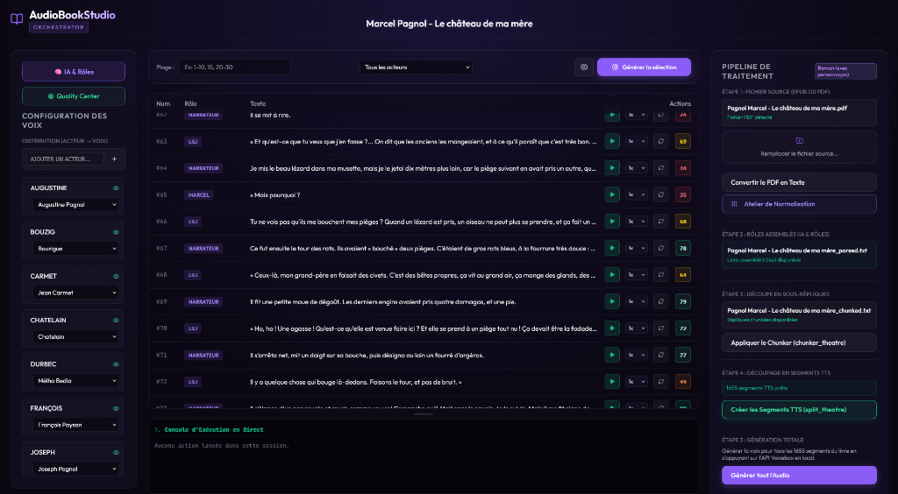
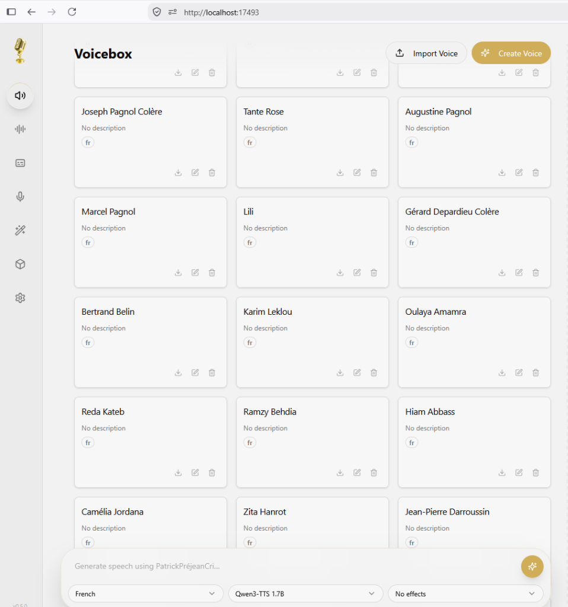
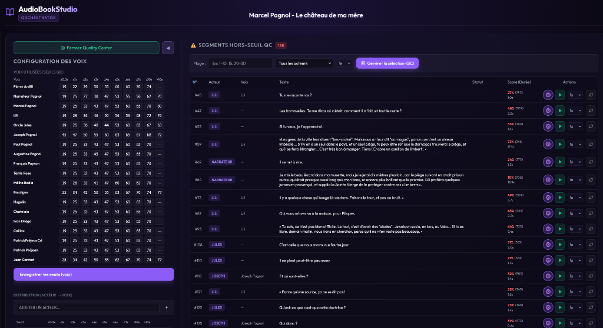

# 🎙️ AudioBookStudio

**AudioBookStudio** est une suite de production complète et 100% locale pour concevoir des **livres audio immersifs et polyphoniques (multi-voix)** à partir de romans et de pièces de théâtre.

Contrairement aux outils de doublage rapide ou de synthèse vocale généraliste, AudioBookStudio a été pensé comme une véritable **chaîne industrielle de fabrication de livres audio**, spécialement optimisée pour la typographie et la littérature française.

---

## 📸 Aperçu de l'interface

### 1. Tableau de bord des projets
Gérez l'ensemble de vos romans et pièces de théâtre avec suivi précis de la progression de génération et export audio final.


### 2. Studio de Production & Assignation des Rôles
Un tableau de bord par projet permettant d'associer chaque personnage à une voix dédiée, d'écouter les répliques segment par segment, d'ajuster le tempo et de régénérer une prise isolée.


### 3. Atelier Vocal VoiceBox (http://localhost:17493)
La création, le clonage zéro-shot et la gestion des profils vocaux sont propulsés par **VoiceBox**.


### 4. Quality Center (Contrôle Qualité Acoustique)
Détection automatique des dérives de voix et des hallucinations grâce au modèle d'empreinte vocale **VoxCeleb (ONNX)**. Isolez et corrigez en un clic les segments hors-seuil.


---

## 🙏 Remerciements à l'équipe VoiceBox

Un immense merci et un coup de chapeau à l'équipe du projet open-source **[VoiceBox](https://github.com/jamiepine/voicebox)** (créé par Jamie Pine et ses contributeurs). 

**VoiceBox est le moteur TTS central qui fait battre le cœur d'AudioBookStudio.** C'est dans son interface dédiée que vous façonnez et clonez les voix de vos personnages à partir de simples extraits audio :
👉 **Interface VoiceBox :** [http://localhost:17493](http://localhost:17493)

AudioBookStudio vient s'articuler autour de VoiceBox pour apporter tout ce qui manquait pour transformer un texte brut en une œuvre littéraire complète.

---

## ✨ Fonctionnalités clés

1. **Ingestion & Normalisation avancée** :
   - Import direct de fichiers **PDF** ou **EPUB**.
   - Atelier de normalisation pour corriger la typographie française : suppression des en-têtes, gestion des césures de mots, tirets cadratins, espaces insécables et ligatures (`œ`, `æ`).

2. **Découpe chirurgicale des phrases (Sentence Chunking)** :
   - Découpe strictly basée sur les fins de phrases (`.`, `!`, `?`).
   - Ne coupe **jamais** sur une virgule, un point-virgule ou en plein souffle afin de garantir une intonation naturelle au moteur TTS.

3. **Attribution des Rôles par IA locale (`WhoIsSpeaking`)** :
   - Pour les romans polyphoniques et les pièces de théâtre, un LLM local (via LM Studio ou Ollama) analyse le récit, sépare les dialogues de la narration et attribue chaque réplique au bon personnage, avec didascalies.

4. **Contrôle Qualité automatique (QC Center)** :
   - Compare chaque segment audio généré à l'empreinte biométrique de référence de la voix (modèle VoxCeleb ONNX).
   - Détecte instantanément si le modèle a dérivé, bafouillé ou changé de timbre.

5. **Pack de 80+ voix françaises préconfigurées** :
   - Des voix de narrateurs et d'acteurs de premier plan (Pierre Arditi, Jean-Pierre Marielle, Catherine Frot, Gérard Depardieu, les voix de la trilogie marseillaise de Marcel Pagnol, etc.) téléchargeables directement dans les [Releases](https://github.com/V1rtuaW0rld/AudioBookStudio/releases/tag/v1.0.0).

---

## 🚀 Installation & Démarrage

### Prérequis
* **Docker Desktop** installé et fonctionnel.
* Carte graphique NVIDIA recommandée avec **au moins 12 à 16 Go de VRAM** (pour faire tourner confortablement le modèle TTS et le LLM local d'attribution des rôles).

### 1. Cloner le dépôt
```bash
git clone https://github.com/V1rtuaW0rld/AudioBookStudio.git
cd AudioBookStudio
```

### 2. Installer le pack de voix françaises (Recommandé)
Pour disposer immédiatement des 80+ voix françaises dans votre studio sans devoir les cloner une à une :
1. Rendez-vous sur la page des [Releases](https://github.com/V1rtuaW0rld/AudioBookStudio/releases/tag/v1.0.0).
2. Téléchargez le fichier **`AudioBookStudio-French-Voices-v1.0.zip`** (62 Mo) et placez-le à la racine du dossier `audioBookStudio`.
3. Sous PowerShell, exécutez simplement :
```powershell
.\import-voice-pack.ps1
```
*(Vos profils et échantillons de référence sont automatiquement décompressés et configurés dans `VoiceBox/data`).*

### 3. Lancer l'application
Sous Windows (PowerShell) :
```powershell
.\run-docker.ps1
```
*(Le script détecte automatiquement votre GPU Nvidia et démarre la stack complète sous Docker).*

Sous Linux / Mac :
```bash
docker compose up -d
```

### 4. Accéder aux interfaces
* **Studio AudioBookStudio (Projets, Orchestration & QC) :** [http://localhost:5180](http://localhost:5180)
* **Atelier VoiceBox (Clonage & Gestion des voix) :** [http://localhost:17493](http://localhost:17493)

---

## 📖 Mode d'emploi pas à pas

### Étape 1 : Créer ou vérifier les voix dans VoiceBox
Rendez-vous sur [http://localhost:17493](http://localhost:17493). Si vous avez exécuté `import-voice-pack.ps1`, vous verrez immédiatement vos profils d'acteurs. Vous pouvez également cliquer sur **"Create Voice"** pour créer de nouveaux personnages à partir de clips audio propres de 10 à 30 secondes.

### Étape 2 : Créer un projet de livre
Sur [http://localhost:5180](http://localhost:5180), cliquez sur **"Nouveau Projet"** :
* Choisissez le type : **Roman (mono-narrateur)**, **Roman (avec personnages)** ou **Théâtre**.
* Chargez votre fichier source (PDF ou EPUB).

### Étape 3 : Normaliser le texte
Ouvrez l'**Atelier de Normalisation**. Utilisez les règles typographiques intégrées pour supprimer les bruits de numérisation, les numéros de page et harmoniser les dialogues. Validez pour enregistrer.

### Étape 4 : Découper ou attribuer les rôles par IA
* **Pour un roman classique** : Cliquez sur *Créer les segments* pour lancer le découpeur strict.
* **Pour un roman polyphonique** : Lancez le module **🧠 IA & Rôles**. Le modèle local détecte qui parle et sépare la narration des répliques. Cliquez ensuite sur *Assembler le livre*.

### Étape 5 : Distribution et Génération
Dans le panneau de gauche, associez chaque rôle détecté à une voix de VoiceBox (ex : Narrateur ➔ Pierre Arditi, César ➔ Jean Carmet). Cliquez sur **Générer tout l'Audio** ou générez les plages de votre choix.

### Étape 6 : Contrôle Qualité et Export
Ouvrez le **Quality Center**. Tous les segments présentant une anomalie de timbre ou de durée sont surlignés. Écoutez-les individuellement et cliquez sur le bouton de régénération si nécessaire. Une fois satisfait, exportez le fichier audio complet assemblé !

---

## 📜 Licence & Crédits
* **AudioBookStudio** : Développé par **V1rtuaW0rld**.
* **Moteur TTS VoiceBox** : [VoiceBox](https://github.com/jamiepine/voicebox) par Jamie Pine (Licence MIT).
* **Modèle d'empreinte vocale QC** : VoxCeleb ResNet34 ONNX.
